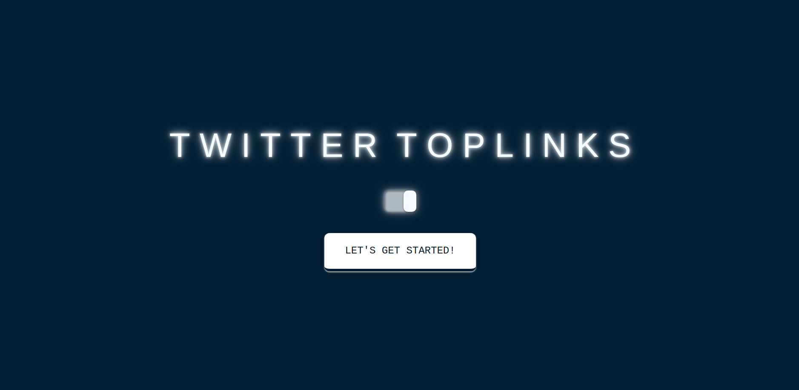
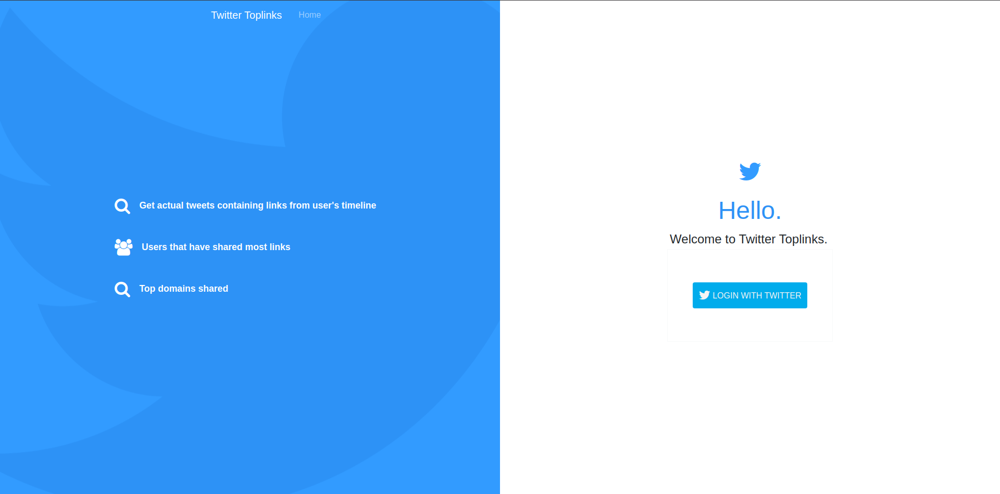
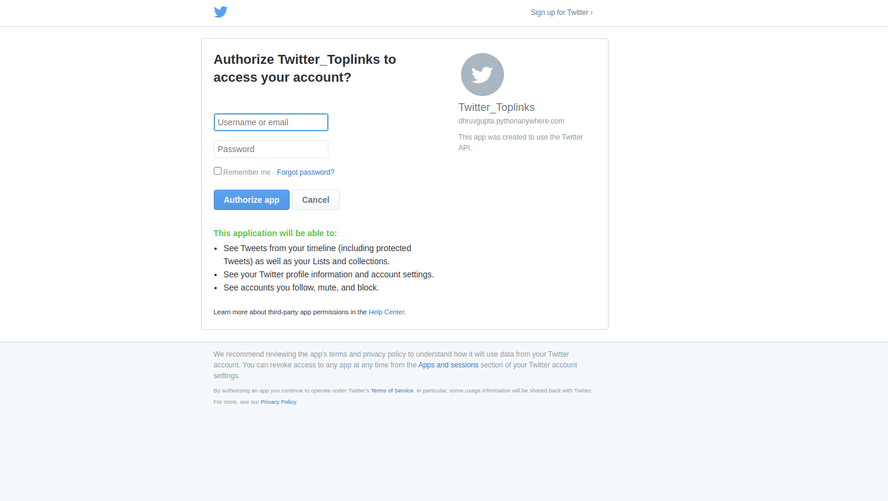
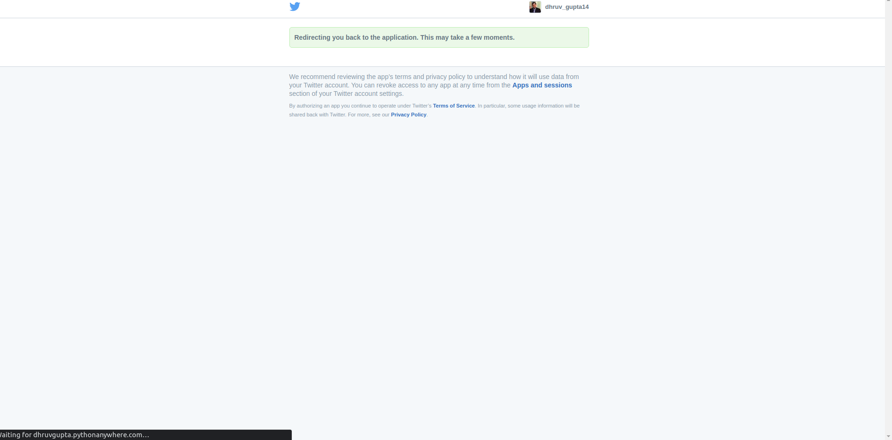
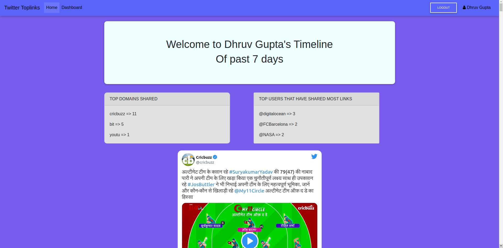
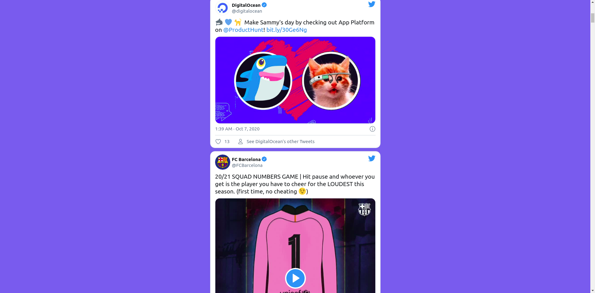
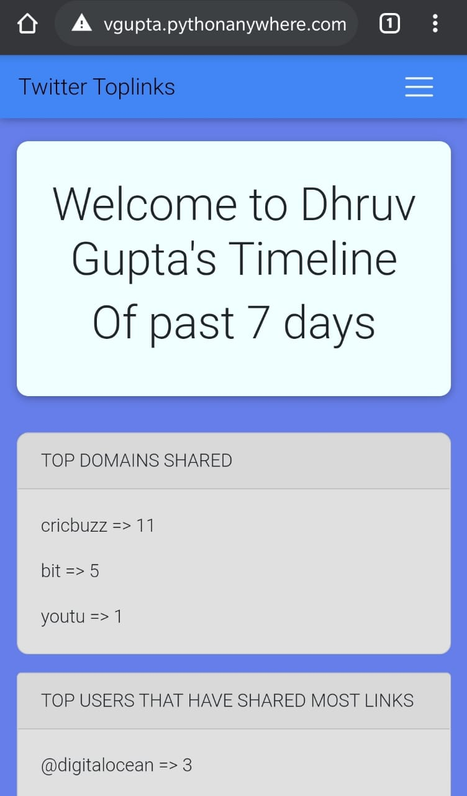
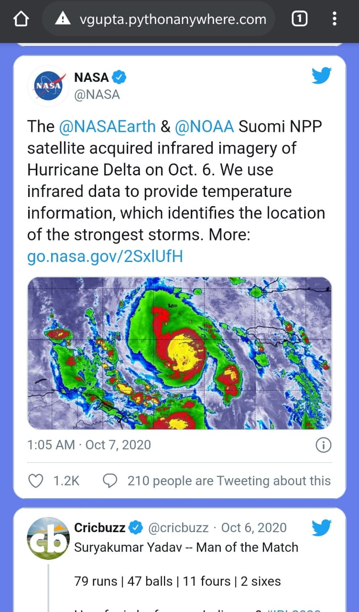
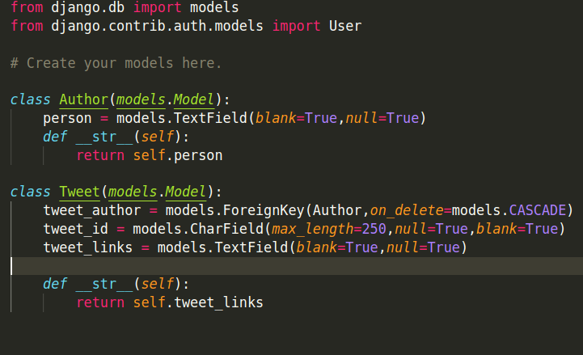

# TWITTER TOPLINKS WEB APPLICATION 

The project aims at creating a web application with ``Django Framework`` with the following functionalities -
* Let the user login with Twitter.
* After authenticating, fetch tweets containing urls from user's timeline (friends + user's tweets) from past 7 days and displays them.
* Display most shared domains from user's timeline.
* Display top users that have shared most links.

## Deployment
* Web App has been successfully deployed on ``PythonAnywhere``. It can be accessed [here](http://dhruvgupta.pythonanywhere.com/).

## Pre-Requisites
* Django Framework should be installed on your system
* Python v3.8 should be installed on your system
* PIP Packages should be installed on your system
* Basic understanding of HTML, CSS, JS
* Understanding of Tweepy API
* Developer account on Twitter for Secret Keys
* Read the  Installing Dependencies and Starting the project section below carefully before usage.

## Technology Stack

**Frontend**
* HTML 
* CSS
* JavaScript
* Bootstrap

**Backend**
* Django
* Python 3.8

 **Database**
 * SqLite3
 
 **APIs**
 * Twitter API - for secret keys
 * Tweepy API - An easy-to-use Python library for accessing the Twitter API


## Installing Dependencies
To run the app locally follow the below steps : 
* Clone the repository.
```
git clone https://github.com/dhruv-gupta14/Twitter-Toplinks.git
```
* Run the following command -
```
pip install -r requirements.txt
```
* Make ``migrations`` to the database.
```
python3 manage.py makemigrations
python3 manage.py migrate
```
* In tweets folder make ``config.py`` file using following command -
```
cd Twitter-Toplinks-main/tweets
touch config.py
```
* Generate a ``secret key`` for django app using - 
```
Open python shell using python command in terminal
import secrets
secrets.token_hex(24)
```
* Store the output in ``SECRET_KEY`` in ``config.py`` file.
* Also get ``CONSUMER_KEY`` AND ``CONSUMER_SECRET`` using Twitter Developer Account from [here](https://developer.twitter.com/en) and store in `config.py` file
* Finally ``config.py`` file will look like - 

```
CONSUMER_KEY=''
CONSUMER_SECRET=''
SECRET_KEY=''
```


## Starting the Project
* Start the project using - 
```
python3 manage.py runserver
```
* Browse to http://127.0.0.1:8000/ to see your web app.

## Implementation

* On Landing page we have a ``Let's Get Started`` button.
* After clicking on it will take user to ``Twitter Login Page``.
* After clicking on ``Login with Twitter`` button, ``Tweepy API`` will take user to authorize with Twitter page and will validate user's credentials. If correct it will redirect the user to ``Dashboard`` page containing information about user's timeline.
* ``Auth`` view and ``Callback`` view will take care of all authentication using Tweepy API.
* For login and logout views we used Django's inbuilt ``LoginView`` and ``LogoutView``.
* User's data in stored in ``database`` which is then used to find out top authors and top domains.
* Tweet information database is stored using ``Tweepy API``. Tweets containing urls and of past 7 days are fetched using ``home_timeline`` method and stored in ``Tweets Database``. Tweet's author is stored in ``Author Database``.
* Tweets on Dashboard page are elegantly shown using ``OEmbed API``.
* All these steps takes place in ``Dashboard`` view.
* Clicking on ``logout`` button on dashboard page will take user back to ``home`` page.
* While being logged in, if user goes to login page it shows Go to ``Dashboard Button`` and ``Logout Button``.

## Workflow

**Landing Page**
* Browse to the url [http://dhruvgupta.pythonanywhere.com/](http://dhruvgupta.pythonanywhere.com/) to see the landing page.


**Login Page**
* Clicking on Login with Twitter Button will take you to Twitter's Authorization Page.

> Login Page

**Twitter's Authorization Page**

> Twitter Login


> Authorization

**Dashboard**
* This page contains all the tweets of User's Timeline of past 7 days. It also shows stats such as Top domains shared and Top users that have shared most links.

> Dashboard Page View



**Responsive Mobile View**


> Mobile View




> Login page when user still logged in

## Database Schema
 Schema model consisting of 2 tables - Author and Tweets



## Author

Name - Dhruv Gupta
Email-ID - 17uec044@lnmiit.ac.in
